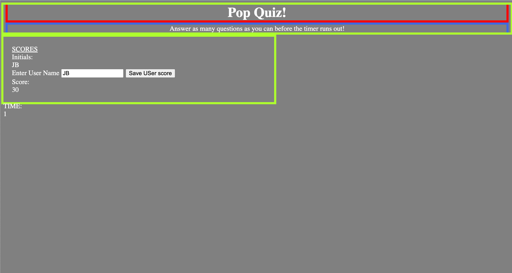

# Jenn-Quiz-Website

## Website Purpose
TO complete a pop-quiz on a user's knowledge of web development.

### Process

To start this I went into it with the mindset that I want to learn code so instead of just going into bootstrap and copying something to make it 'easier' on myself. I wanted to start with the skeleton of the html, and then move into a little css to nail in those key attributes. Once those are establisted I can stuff this with the muscles and thoughts to define how it interacts with its' user. All the while filling in the gaps where it was needed and referring to pervious class material to fulfill in the requirements. 
The main focus for me was in the .js I reviewed how I used if, else, and in the mini project to logically read when the timer should start, when elements like the results and score are visible or hidden when calling an event to fufill its purpose. my favorite part was working on the shorest code to complete the timer algorithm. After reviewing it with my tutor, she was able to explain how it's placement in the code can link thoughout the other text elements to generate the accurate results for the user. 

### Challenges

I had a really hard time getting the text to freeze when it say's "you're done!" when you complete your quiz. It shows for a brief second and then the timer continues. I also feel like I rushed though this assignment as I did not want to get too behind.

#### Screenshot

#### Links

[Live Site](https://jpcreativeworks.github.io/Jenn-Quiz-Website/)
[GitHub Https](https://github.com/jpcreativeworks/Jenn-Quiz-Website.git)